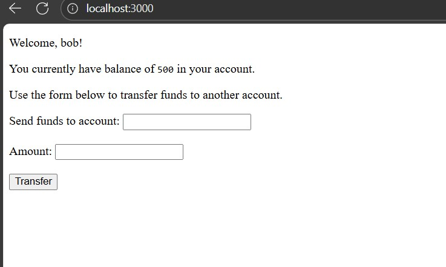
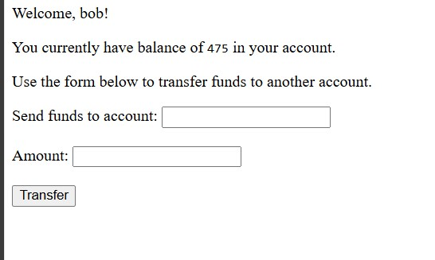
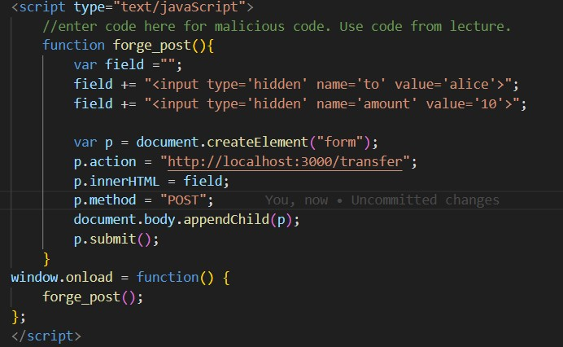

# Cross Site Request Forgery Lab

The objective of this lab is to explore Cross-Site Request Forgery and see how a malicious page can take advantage of users.

## 5a

The current balance on the target site is `500`.

## 5b

By clicking the link `Click here to upgrade!!!`, I see Bob's current balance decreases from `500` to `475`.
The balance decreases because bob's logged in and the malicious page automatically triggered a transfer using a GET request.

## 6

The vulnerability is in the POST `/transfer` route. The server trusts the session cookie and does not use any CSRF protection (like CSRF token). Because of this, a malicious website can automatically send a transfer request while the user is logged in, and the server will still do the money transfer without the user’s knowledge.

## 7

    

`

		Or by tricking the target user into clicking a malicious link:
		<a href="http://localhost:3000/transfer?to=alice&amount=25">Click here to upgrade!!!</a>
	
`

    ` <!-- 

    	Or by tricking the target user into clicking a malicious link:
    	<a href="http://localhost:3000/transfer?to=alice&amount=25">Click here to upgrade!!!</a>
    
 -->`

         

## 8

     

     

     When I clicked `http://localhost:3001/`, the malicious page automatically sends a hidden request to http://localhost:3000/transfer. Since I am already logged in as bob, my browser sends my login cookie with the request. The server thinks bob made the request, so it transfers money and the balance decreases without me clicking anything.

## 9

We can use CSRF token as an countermeasure. The server checks a secret token in each request to make sure the request is coming from the real website and not from a malicious page.
