# Environment Variable and Set-UID Program Lab

This lab explores environment variables and Set-UID behavior in Linux.

## 1. Environment Variable Operations

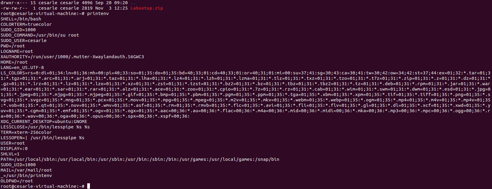

After applying command `printenv`, what I saw are:

- The list of environment variables
- USER is root at the time because I'm switched to root

Command `printenv` shows all of the environment variables that are currently in the shell. These variables are used by programs for knowing the user name, where files are located and which shell is being used.

Command "printenv PWD" shows where we are in the files system, which means I was currently in the root home directory.

After exporting, command `printenv my_lab` prints `lab3`. `export` makes the variable part of the environment so other programs and child shells can use it.

After using `unset`, `printenv my_lab` prints nothing, which means `unset` removes a variable from shell environment. This surprised me because the variable's deleted without any notification or sign.

## 2. Passing Environment Variable from Parent Process to Child Process

This task shows how a child process inherits its environment variables from its parent process.

Command `gcc myprintenv.c` was compiled and showed no errors so the code is ready to run. I used the command `./a.out > file` to run the program and save the environment variables into a text file named file.

I used `nano` command to open file `myprintenv.c` to edit it. The editing includes commenting out `printenv()` statement in the process case and uncommenting "printenv()" statement in the parent process case.

I used the command `./a.out > file2` to run the program again. This run save only the parent's environment so I can compare it with the first output. After using command "diff file file2" to compare 2 outputs, I see that there's no differences which mean the environment variables are identical. This confirms the child inherits a copy of the parent's environment.

## 3. Environment Variables and `execve()`

This task demonstrates how the environment variables are affected by executing a program using `execve()` function.

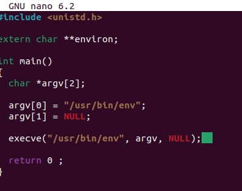

This is the program `myenv.c`. After compiling, this program prints nothing (no environment variables are printed because of NULL for environment), which means the child process didn't receive the environment.

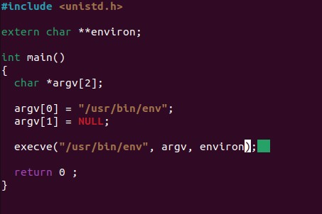

I used command `nano myenv.c` to open the file "myenv.c" and change the invocation of execve() by passing environment `environ`.

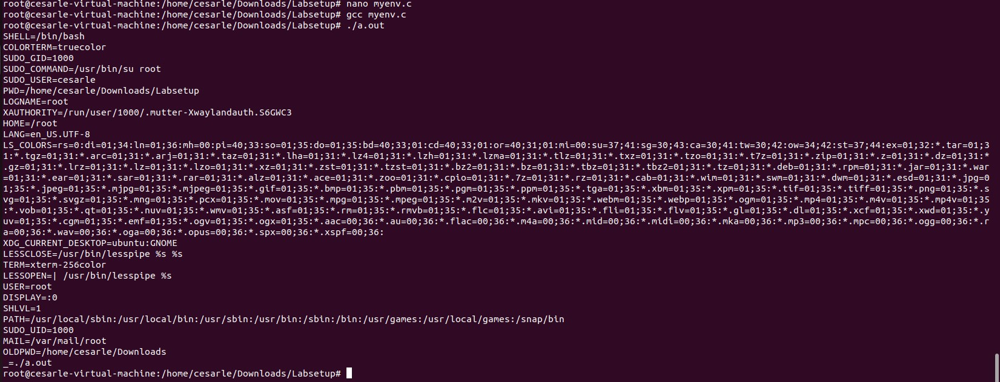

After compiling, I could see the output shows environment variable such that PATH, USER and HOME. I also noticed that after passing `environ`, the program prints out full env. This meant the child inherited parent environment variables. Therefore, the environment variables are not automatically inherited and they must be explicitly passed.

## 4. Environment Variables and system()

This task includes how `system()` affects environment variables and confirm if a program invoked `system()` inherits environment variables.

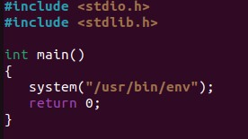

I created a program named `mysystem.c` to test out `system()` function. Then, I compiled and run the program and watch the output.

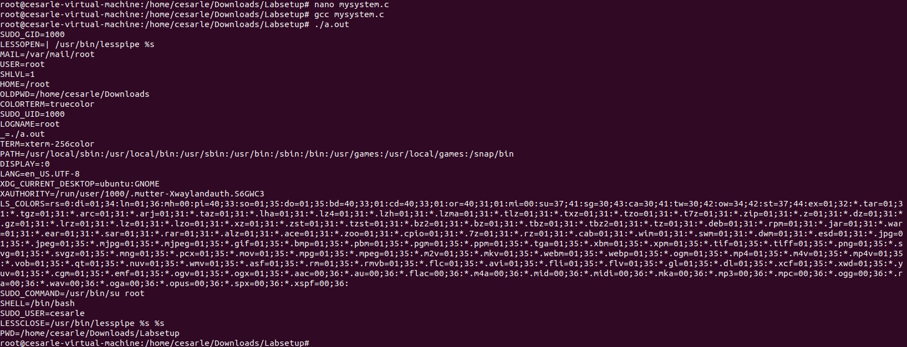

I could see the shell started by `system()` printed the environment list. `system()` ran a shell that inherited the caller's environment. So, the program runs by `system` sees the same environment variables as the calling process.

## 5. Environment Variables and `Set-UID` Programs

This task shows how environment variables behave when running `Set-UID` root program.

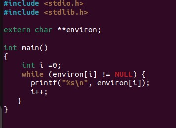

I wrote a program named `test.c` that prints all environment variables. Then I compiled it, changed its owner to root.

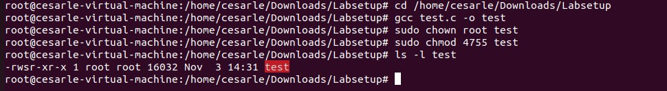

The files showed the `Set-UID` bit (s in the permission).

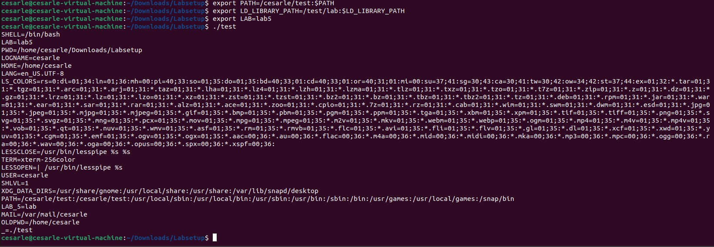

I exported the environment variables as the regular user:

`export PATH=/cesarle/test:$PATH`
`export LD_LIBRARY_PATH=/test/lab:$LD_LIBRARY_PATH`
`export LAB=lab5`

Then, I ran the `test` program. It printed a list of environment variables, including the variables I set earlier.

## 6. The `PATH` Environment Variable and `Set-UID` Programs

This task shows how modifying the `PATH` environment variable can be used attack a `Set-UID` program. If a privileged program uses `system()`, the shell will search for commands based on `PATH`. If the attacker place a fake program earlier in the search path, the `Set-UID` program may run it instead of the legitimate one.

I wrote a file named `task6.c` that calls `system("ls")`.

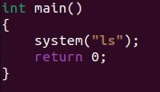

Then I compiled the program and made it `Set-UID` and owned by root.

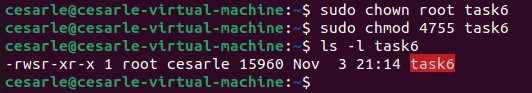

This gives the binary the `s` bit which means it will run with root privileges.

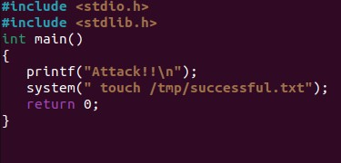

I created a fake program named `ls.c` that tried to execute the root shell when executed.

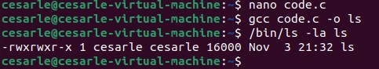

I could see that `ls` existed in the working directory.

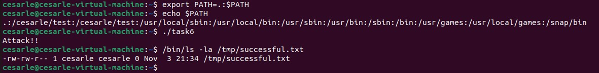

Next, I modified the `PATH` environment variables, ran command `export PATH=.:$PATH` to trick the system into running the fake program that I created.
When `ls` is called, the shell wil try the fake `ls` first. Then, I executed the vulnerable `Set-UID` binary and I could see the message `Attack!!`.
Then, I checked if the privileged file action occurred by using command `/bin/ls -la /tmp/successful.txt`. The files exists which mean the attack worked.

## 7. The `LD_PRELOAD` Environment Variable and `Set-UID` Programs

This task shows how the dynamic loader handles environment variable `LD_PRELOAD` and whether a preloaded library can override a function when the target program is run normally.

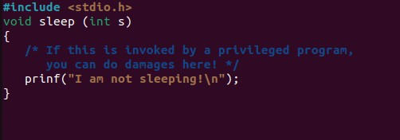

I used the program named `mylib.c` to implement a malicious `sleep()` function.

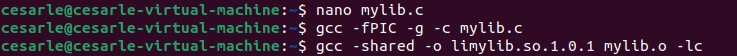

Then, I compiled the malicious program into a library using command `gcc -fPIC -g -c mylib.c` and `gcc -shared -o limylib.so.1.0.1 mylib.o -lc`.

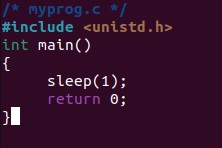

I wrote a program named `myprog.c` that calls `sleep()` function and compiled it with `LD_PRELOAD`.

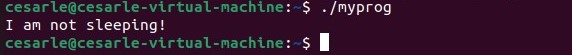

The output's `I am not sleeping!` and the normal program showed malicious library loaded.

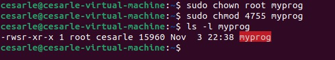

Next, I made `myprog` a `Set-UID` root program.

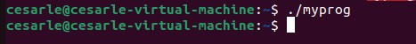

I could see the `Set-UID` program ignored `LD_PRELOAD` and the fake `sleep` wasn't invoked.

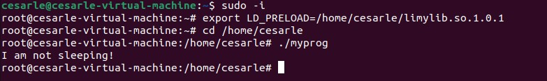

Next, I ran the `Set-UID` program as root. Then, the output showed `I am not sleeping`. This showed that `LD_PRELOAD` worked because the real UID and effective UID were both root. The system only blocks `LD_PRELOAD` when a normal user runs a Set-UID program, but allows it when the owner runs it.

The system ignored LD_PRELOAD when a normal user ran a Set-UID root program because the real UID didn't match the effective UID. This prevents attackers from injecting malicious libraries into privileged programs. When root ran the program, both UIDs match, so LD_PRELOAD works.

## 8. Invoking External Programs Using `system()` Versus `execve()`

This task focuses on the use of `system()` compared to `execve()`.

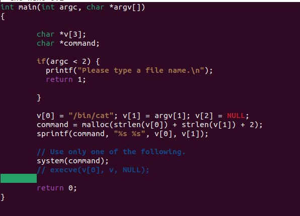

First, I compiled the program named `catall.c` with system enabled.

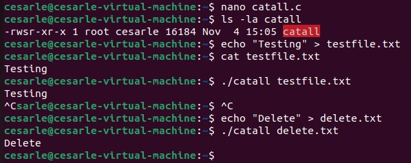

Next, I created two files for testing named `testfile.txt` and `delete.txt`.

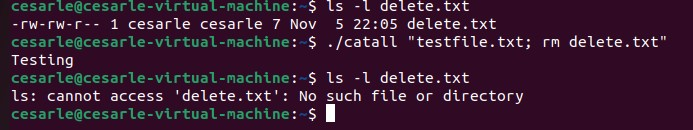

Then, I ran the command `./catall "testfile.txt; rm delete.txt"`. The output showed only `Testing` from file `testfile.txt` which meant the file `delete.txt` was removed.

This behavior shows the dangers of using `system()`. Because `system()` invokes a shell, it interprets the input as a full shell command rather than a single argument. In this case, what was intended to be a single filename argument (`testing.txt`) was treated as two commands (`./catall testing.txt` and `rm delete.txt`), allowing unintended actions to occur.

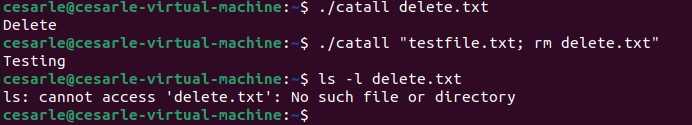

Running `./catall "testing.txt; rm delete.txt"` with `execve()` threw an error stating `no such file or directory exists`. Unlike `system()`, `execve()` does not invoke a shell, so the input was treated as a single argument, preventing unwanted actions such as removing a file.

## 9. Capability Leaking

Set-UID programs sometimes need to drop their root privileges after finishing privileged work. However, if they don't properly clean up privileged resources, these "capabilities" can leak to the non-privileged process.

I created a file `/etc/zzz` owned by root.

I wrote a file named `cap_leak.c` that opens `/etc/zzz` with root privileges, made it `Set-UID`root and compiled it. The program output's `fd is 3` (file descriptor number is 3) and it started a shell.

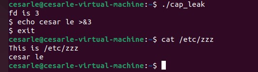

I used command `echo cesar le >&3` and `exit` for exiting. After testing, I found that the string that I created `cesar le` had been appended to the file.
The program opened `/etc/zzz` with root privileges and got file descriptor 3. Then it dropped privileges to become a normal user. However, it forgot to close the file descriptor, so file descriptor 3 was still open in the shell. This let me write to the file even though I was now a normal user. To prevent this, the program should close the file descriptor before dropping privileges.
In general, Set-UID programs must clean up all privileged resources before becoming non-privileged.
