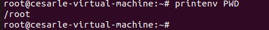
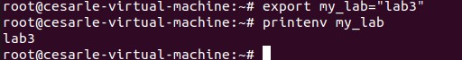
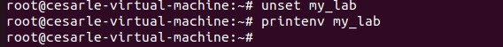
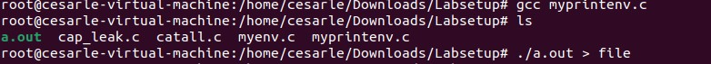
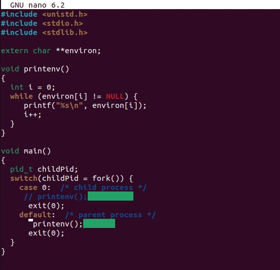
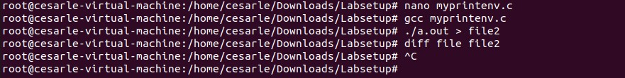

# Environment Variable and Set-UID Program Lab

### Environment Variable Operations

!(./lab3_images/task1/printenv.jpg)

After applying command "printenv", what I see are:

- The list of environment variables
- USER is root at the time because I'm switched to root

Command "printenv" shows all of the environment variables that are currently in the shell. These variables are used by programs for knowing the user name, where files are located and which shell is being used.

Command "printenv PWD" shows where we are in the files system, which means I was currently in the root home directory.

After exporting, command "printenv my_lab" prints "lab3". "export" makes the variable part of the environment so other programs and child shells can use it.

After using "unset", "printenv my_lab" prints nothing, which means "unset" removes a variable from shell environment. This surprises me because the variable's deleted without any notification or sign.

### Passing Environment Variable from PArent Process to Child Process

Command "gcc myprintenv.c" is compiled and shows no errors so the code is ready to run. I use the command "./a.out > file" to run the program and save the environment variables into a text file named file.

I use "nano" command to open file "myprintenv.c" to edit it. The editing includes commenting out "printenv()" statement in the process case and uncommenting "printenv()" statement in the parent process case.

I use the command "./a.out > file2" to run the program again. This run save only the parent's environment so I can compare it with the first output. After using command "diff file file2" to compare 2 outputs, I see that there's no differences which mean the environment variables are identical. This confirms the child inherits a copy of the parent's environment.

### Environment Variables and execve()
